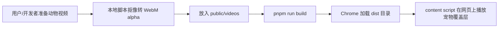
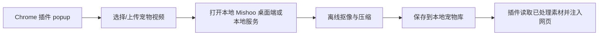

# 动物视频形象提取与 Chrome 插件化方案

## 当前状态

Mishoo 现在已经具备两条链路：

1. **桌面 / Web 预览**：React + Vite + Electron。运行 `pnpm run dev` 后会启动 Vite，并由 Electron 打开桌面窗口。
2. **Chrome Extension MVP**：运行 `pnpm run build` 后，`dist/` 同时包含扩展所需的 `manifest.json`、popup、background service worker、content script 和视频资源。可在 `chrome://extensions` 加载 `dist/` 测试。

视频呈现上，项目支持：

- **当前默认路径：绿幕源视频 + 运行时 canvas 抠绿**。这样可以保证动物的 RGB 内容一定可见，不会因为不可靠的 alpha WebM 被浏览器解码成全透明而消失。
- 已经带可靠透明通道的视频仍可通过 `hasAlpha: true` 直出播放；不要仅根据文件名包含 `alpha` 判断，必须先在 Chrome/Electron 里验证透明通道确实可见。
- Electron/Web 端和 Chrome content script 端都使用一致的 canvas 处理逻辑：背景像素直接透明、边缘残绿做 despill；同时将实时处理限制到 1280 最大边长和约 24fps，降低 CPU 开销。

> 2026-07-09 调整：之前生成的 `*-alpha.webm` 在本机探测中不够可靠，默认不再使用；内置素材改回 `*-source.webm` 走实时抠绿。

## 当前提取能力的问题

“上传视频里动物形象提取”的质量取决于素材类型：

| 素材类型 | 当前可行性 | 问题 |
| --- | --- | --- |
| 透明背景视频 / ProRes 4444 | 最好 | 只需转成 WebM VP9 alpha |
| 纯绿幕 / 蓝幕 / 黑白底 | 好 | 需要调 key color、similarity、blend；毛发边缘可能有残色 |
| 普通室内/户外复杂背景 | 一般 | 需要 AI 视频抠像；帧间闪烁、脚下阴影、细毛发最难 |
| 有水印、地面、墙面、移动镜头 | 差 | 自动抠像会误删动物或保留背景残片 |

## 推荐产品级处理链路

### 1. 上传与素材诊断

上传后先自动探测视频：

- 是否已有 alpha：`ffprobe` 检查 `pix_fmt` / `alpha_mode`。
- 背景是否接近纯色：抽取若干帧，采样边缘区域，判断主背景颜色和方差。
- 分辨率、时长、帧率、体积是否适合插件内播放。

诊断结果决定走哪条处理链路。

### 2. 分层处理策略

优先级建议如下：

1. **已有 alpha**：直接转码为 `WebM VP9 alpha`，这是最稳的。
2. **纯色背景**：用 FFmpeg `chromakey` / `colorkey` 离线生成透明 WebM，而不是依赖浏览器实时抠像。
3. **复杂背景**：用 AI matting 离线处理，输出透明 WebM。
4. **仍然不干净**：系统自动尝试另一组 key color、similarity、blend、边缘腐蚀/膨胀、羽化和 despill 参数；超过重试次数则提示用户重传，不进入人工处理。

### 3. 输出统一格式

Chrome 插件中建议只播放处理后的：

```text
public/videos/<pet-id>-alpha.webm
```

规格建议：

- 编码：VP9 + alpha。
- 尺寸：最长边 1280 或 1920；插件内优先 1280，更省 CPU/GPU。
- 帧率：24 或 30fps。
- 时长：5-12 秒；前半段入场，后半段静态趴下/坐下循环。
- 文件体积：尽量低于 3-5MB，避免扩展包过大。

## 现有脚本怎么用

### 纯色背景 / 已有 alpha

```bash
pnpm run video:key -- input.mp4 --out public/videos/custom-pet-alpha.webm --preview public/videos/custom-pet-preview.png
```

常见参数：

```bash
# 绿幕
pnpm run video:key -- input.mp4 --mode chroma --key 00ff00 --similarity 0.25 --blend 0.10

# 黑底
pnpm run video:key -- input.mp4 --mode black --similarity 0.12 --blend 0.08

# 已有透明通道 MOV
pnpm run video:key -- input.mov --mode alpha
```

### AI 抠像

```bash
pnpm run video:ai -- input.mp4 --out public/videos/custom-pet-alpha.webm --preview public/videos/custom-pet-preview.png
```

第一次会安装 Python 虚拟环境、PyTorch CPU 和 `backgroundremover`，会比较慢。AI 抠像建议作为“离线/本地桌面端能力”，不要放到 Chrome extension content script 里实时跑。

## Chrome 插件化架构建议

### MVP：预处理后打包

当前项目已经有 Chrome Extension MVP；内置演示素材暂时采用“源视频 + 运行时抠绿”。产品级上传链路建议最终采用这个方案：



优点：稳定、权限少、运行时轻。缺点：用户上传新宠物后需要重新构建插件。

### 下一阶段：桌面伴侣 + 插件联动

更适合产品化：



原因：Chrome 插件不适合安装 PyTorch、运行大模型或长时间处理视频；Electron 桌面端更适合做上传、预览、处理队列和本地素材管理。

### 纯插件高级版

如果坚持所有能力都在 Chrome 插件内，可以做：

- popup 接收视频文件。
- Offscreen document / worker 解码视频帧。
- WebAssembly FFmpeg 或 WebGPU/TensorFlow.js 做抠像。
- 结果写入 IndexedDB。
- content script 从 extension storage/IndexedDB 取 Blob 播放。

但这个路线开发复杂、包体大、性能和浏览器兼容风险高，不建议作为当前阶段主路线。

## 近期最值得做的优化

1. **把所有示例源视频离线转成 `*-alpha.webm`**，插件运行时尽量不做 canvas 抠像，只做播放。
2. **新增“处理质量预览页”**：展示透明背景、深色背景、浅色背景三种预览，快速看边缘残留。
3. **加自动诊断脚本**：检测 alpha、背景颜色、推荐 `video:key` 参数。
4. **宠物配置数据化**：把 `PetId`、名称、视频路径、loop 起点放到 JSON，避免 App 和 extension 各维护一份。
5. **用户自定义宠物库**：桌面端处理上传视频，生成本地 `alpha.webm`，插件只负责选择和播放。

## 增加新动物 / 新角色素材的实操说明

### 是否支持 GIF？

可以支持，但建议把 GIF 当成“轻量兜底格式”，不要当成主力格式。

- **适合用 GIF 的情况**：小角色、像素风、短循环动画、已经是透明背景的 GIF。
- **不太适合 GIF 的情况**：真实宠物、毛发边缘、半透明阴影、长视频、大尺寸动画。
- **原因**：GIF 只有非常粗糙的透明能力，边缘容易锯齿；文件也可能比 WebM 更大；还不能像 video 一样精准控制“入场后从第几秒开始循环”。

当前插件已经允许打包本地 `videos/*.gif`、`videos/*.png`、`videos/*.jpg`、`videos/*.jpeg` 作为扩展资源。如果一个角色只配置 `image`、不配置 `video`，休息遮罩会用图片方式显示；这里的 `image` 可以是 GIF。

示例：

```ts
'pixel-cat': {
  name: { zh: '像素猫 Chili', en: 'Chili the Pixel Cat' },
  description: { zh: '一只像素风休息监督员', en: 'A pixel-style break buddy' },
  image: '/videos/pixel-cat.gif',
  credit: 'Transparent GIF character asset',
}
```

Chrome content script 里的本地路径建议写成：

```ts
image: 'videos/pixel-cat.gif'
```

React / Web 预览里的本地路径建议写成：

```ts
image: '/videos/pixel-cat.gif'
```

> 注意：当前宠物配置在 `src/App.tsx` 和 `src/extension/content.ts` 各维护了一份。新增角色时两边都要加。后续建议把配置抽成共享 JSON，避免加一次宠物要复制两遍。

### 增加新动物视频的推荐流程

最推荐的格式仍然是：

```text
public/videos/<pet-id>-source.webm   # 绿幕源视频，运行时抠绿
```

或者产品级更稳的：

```text
public/videos/<pet-id>-alpha.webm    # 已经处理好的透明背景 WebM
```

#### 方式 1：新增绿幕视频，继续走运行时抠绿

1. 准备一个绿幕 / 蓝幕 / 纯色背景动物视频。
2. 转成 WebM，放到：

```text
public/videos/<pet-id>-source.webm
```

3. 在 `src/App.tsx` 的 `PetId` 里加新 id。
4. 在 `src/App.tsx` 的 `PETS` 里加一条配置：

```ts
'new-pet': {
  name: { zh: '新动物名字', en: 'New Pet Name' },
  description: { zh: '一句话介绍', en: 'Short description' },
  image: 'https://example.com/cover.jpg',
  video: '/videos/new-pet-source.webm',
  restLoopStart: 4,
  credit: 'Green-screen source video, chroma-keyed in browser',
}
```

5. 在 `src/extension/content.ts` 的 `PetId` 和 `PETS` 里也加同一只动物：

```ts
'new-pet': {
  name: { zh: '新动物名字', en: 'New Pet Name' },
  video: 'videos/new-pet-source.webm',
  restLoopStart: 4,
}
```

6. 更新 `getSafePet()`，把新 id 加进去。
7. 执行构建：

```bash
pnpm run build
```

8. 重新打包或在 `chrome://extensions` 里刷新插件。

#### 方式 2：新增透明背景 WebM，直接播放

如果视频已经有可靠透明通道，可以配置 `hasAlpha: true`，这样插件不会再做实时抠绿，CPU 更省，边缘也更稳。

```ts
'new-pet': {
  name: { zh: '新动物名字', en: 'New Pet Name' },
  video: 'videos/new-pet-alpha.webm',
  hasAlpha: true,
  restLoopStart: 4,
}
```

注意：不要只看文件名叫 `alpha.webm` 就放心，一定要在 Chrome 里实际看一眼，确认动物不是“隐身术大师”。

#### 方式 3：新增 GIF / 静态角色

适合卡通角色、像素角色、表情包式短动画。

1. 把文件放到：

```text
public/videos/<role-id>.gif
```

2. 在配置里只写 `image`，不要写 `video`：

```ts
'gif-role': {
  name: { zh: '动图角色', en: 'GIF Buddy' },
  image: 'videos/gif-role.gif',
}
```

3. 重新构建并刷新插件。

### 长期建议

如果后面会频繁增加动物 / 人物 / 吉祥物，建议下一步做两件事：

1. **宠物配置数据化**：把 `PetId`、名称、素材路径、循环起点统一放到一个共享配置文件，App 和 Chrome 插件共用。
2. **素材管理后台化**：上传视频后自动生成透明 WebM、预览边缘效果、填写名字和循环起点，最后一键打包插件。
