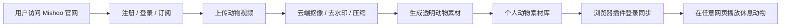
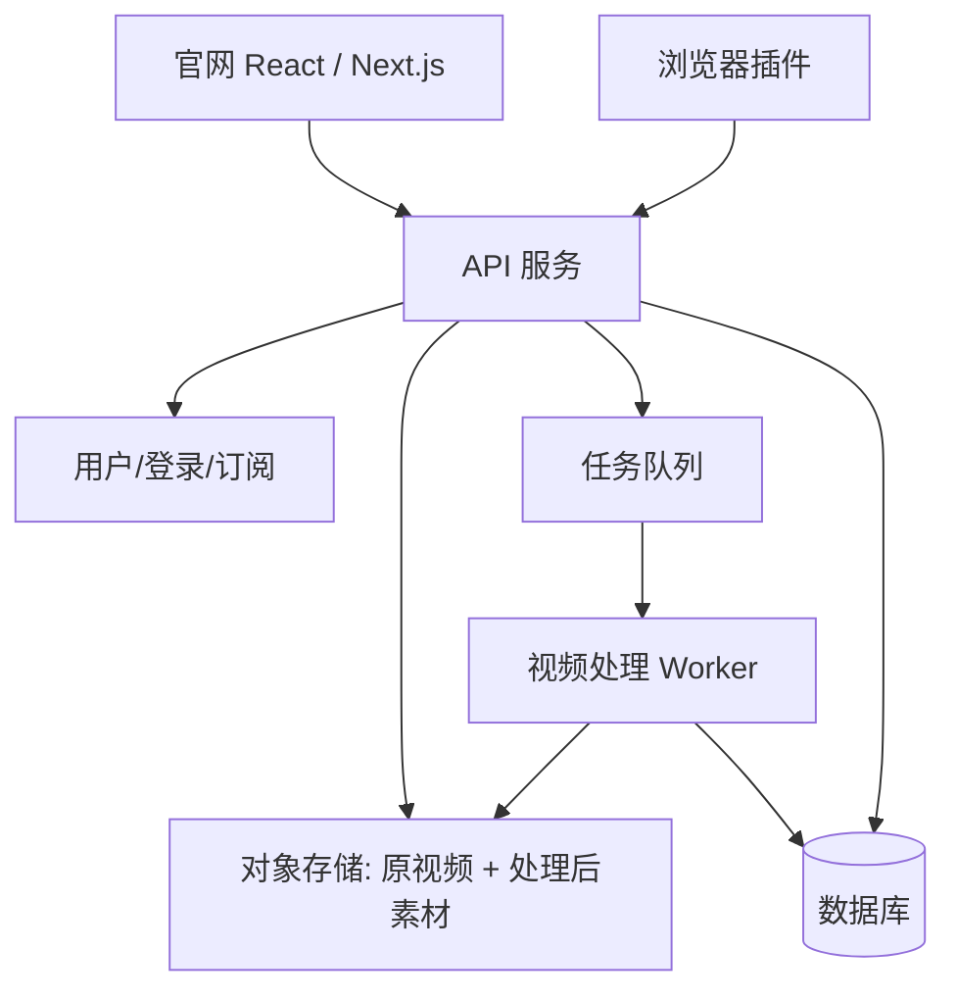

# Mishoo 商业化与多浏览器路线图

## 1. 结论先说人话版

Mishoo 后面如果要商业化，建议做成：

- **一个官网/用户后台**：负责注册、登录、付费、上传视频、云端处理、素材库管理。
- **多个浏览器插件**：Chrome / Edge / Firefox / Safari 负责在用户正在浏览的网页上播放休息动物。
- **一套云端处理服务**：负责把用户上传的视频变成插件能稳定播放的透明 WebM / GIF / PNG 序列等素材。

插件可以做登录和上传，但不建议把“上传处理”全部塞进插件里。原因很简单：插件适合轻量播放和同步，网站适合交易、素材管理、客服、增长、SEO、支付和大文件处理。

## 2. 为什么最终需要 HTML 网站承接？

| 能力 | 插件里做 | 网站里做 | 建议 |
| --- | --- | --- | --- |
| 登录 | 可以 | 很适合 | 两边都支持，网站为主 |
| 付费订阅 | 麻烦，受商店限制 | 很适合 | 网站为主 |
| 上传大视频 | 可以但体验差 | 很适合 | 网站为主 |
| AI 抠像处理 | 不适合本地做重任务 | 很适合 | 云端做 |
| 素材库管理 | 勉强可以 | 很适合 | 网站为主 |
| 在任意网页显示动物 | 很适合 | 做不到 | 插件负责 |

推荐产品形态：



## 3. 用户上传动物视频的理想流程

1. 用户打开官网。
2. 登录账号。
3. 点击“上传我的动物”。
4. 网站提示用户上传 5-12 秒视频。
5. 后端校验格式、大小、时长。
6. 后端排队处理：
   - 提取帧
   - 去水印/去字幕
   - 抠背景
   - 边缘羽化
   - 压缩成透明 WebM
   - 生成预览图
7. 用户在网页上预览效果。
8. 用户保存到“我的动物库”。
9. 插件登录同一个账号后自动拉取动物列表。
10. 到点休息时播放用户自己的动物。

## 4. 上传区应该给用户什么提示？

### 适合上传的视频

- 5-12 秒。
- 动物全身尽量完整。
- 镜头固定，不要疯狂推拉摇移。
- 动物和背景颜色区分明显。
- 最好没有字幕、水印、贴纸、UI。
- 动物最后能坐下、趴下或停住，方便循环。

### 不太适合的视频

- 动物太小，只占画面一点点。
- 背景和动物颜色太像。
- 一堆文字、水印、贴纸挡住动物。
- 镜头一直晃。
- 有多只动物互相遮挡。

## 5. 给用户的 AI 视频 Prompt 模板

如果用户用豆包、即梦、Runway、Pika、可灵等工具先生成视频，可以这样写：

> 一只可爱的【动物/角色】从屏幕底部慢慢爬出来，进入画面中间后坐下/趴下休息，动作自然可爱，完整身体可见，镜头固定，单个角色，不要文字，不要水印，不要字幕，不要 UI，不要复杂阴影，背景使用纯蓝色幕布 #0047FF；如果角色手里有绿色物体，请不要使用绿幕。视频时长 6-10 秒，24fps，横版 16:9。

重点提醒：

- **不要文字、不要水印、不要字幕** 要反复写。
- 角色拿竹子、树叶、草地等绿色物体时，不要用绿幕，建议蓝幕/紫幕。
- 背景颜色越纯，后期越容易处理。
- 如果要做透明效果，最终最好由服务器统一抠像，而不是让用户自己处理。

## 6. 多浏览器发布策略

### 第一阶段：开发者安装包

当前项目已经可以生成：

- Chrome 包：`dist-browsers/mishoo-chrome-extension.zip`
- Edge 包：`dist-browsers/mishoo-edge-extension.zip`
- Firefox 包：`dist-browsers/mishoo-firefox-extension.zip`
- Chrome 本地加载文件夹：`mishoo-chrome-extension/`

命令：

```bash
pnpm run package:browsers
```

### 第二阶段：正式上架

- Chrome：上架 Chrome Web Store。
- Edge：上架 Microsoft Edge Add-ons。
- Firefox：上架 Firefox Add-ons。
- Safari：需要用 Xcode 打包成 Safari Web Extension，一般还需要 Apple Developer 账号和 App Store / 签名分发流程。

## 7. 后端最小可行架构



建议技术选型可以先简单：

- 前端官网：Next.js / Vite React 都可以。
- API：Node.js / Python FastAPI。
- 数据库：PostgreSQL / Supabase。
- 文件存储：S3 / R2 / OSS。
- 队列：BullMQ / Cloud Tasks / Celery。
- 视频处理：FFmpeg + AI matting 服务。

## 8. 账号与插件同步

推荐：

1. 用户在网站登录。
2. 插件点击“登录”。
3. 插件打开网站登录页。
4. 登录成功后回传 token 或使用浏览器扩展 OAuth/Identity 流程。
5. 插件保存短期 token。
6. 插件调用 API 拉取用户动物素材列表。
7. 播放时使用用户选中的透明视频 URL。

不要把长期密钥写死在插件里，插件代码最终用户都能看到。

## 9. 商业化功能分层建议

免费版：

- 使用内置动物。
- 每天固定提醒。
- 少量基础自定义。

付费版：

- 上传自己的动物。
- 多个自定义动物。
- AI 自动抠像。
- 高质量透明视频。
- 多设备同步。
- 更多休息主题。

企业/团队版：

- 团队健康提醒。
- 企业品牌角色。
- 团队素材库。
- 使用统计和健康报告。

## 10. 当前项目已经加上的东西

- 官网首页新增了“自定义动物工作台”区域。
- 用户可以选择本地视频做预览。
- 上传区展示了 AI 视频生成 Prompt 模板。
- 页面解释了为什么商业版需要“网站 + 插件 + 云端处理”。
- 新增 `scripts/package-browsers.mjs`，可以一次性生成 Chrome / Edge / Firefox 包。

---

## 11. 极简商业化执行手册

已基于 `slavingia/skills` 的 10 个商业化技能，补充一份更完整的 Mishoo 商业化落地手册：

- `docs/mishoo-minimalist-commercialization-playbook.md`

这份手册重点建议：先用“用户宠物定制服务”收第一批真实付费，再逐步建设登录、上传、素材库、插件同步和 AI 抠像后台。
