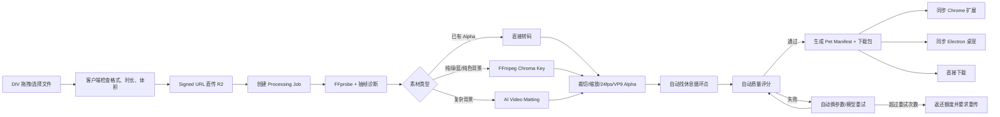

# Mishoo 全自动商业化方案

更新日期：2026-07-30

## 先以现有产品为准

Mishoo 当前的核心不是独立桌面宠物，而是浏览器休息守护：用户选择动物并开始专注计时，时间结束后动物进入当前普通网页，形成全屏休息遮罩；休息结束或用户安全退出后返回网页。

项目已内置 6 只动物：

1. Mia 三花猫
2. Cocoa 金毛
3. Snow 萨摩耶
4. Mochi 博美
5. Mocha 垂耳兔
6. BaoBao 熊猫

当前 6 只动物都通过静态 `PETS` 配置写在 React 页面和 Chrome content script 中。浏览器扩展使用 `chrome.alarms` 计时，结束后注入遮罩；动物视频先播放进场段，再从 `restLoopStart` 循环休息段。

桌面宠物是第二入口：Electron 创建透明、无边框、置顶窗口，目前固定播放熊猫 `idle.webm`，窗口本身自动水平巡逻。它尚未读取用户宠物资产。

## 新的一句话定位

> **Mishoo makes a real pet walk into your browser when it is time to rest.**

中文：到该休息时，让真实宠物走进浏览器，把你从屏幕前带走。

“浏览器休息守护”是主产品；桌面宠物只是同一宠物资产的第二种使用方式，不单独做一套商业系统。

## 全自动商业模型

### Free：免费形成安装与习惯

- 6 只现有 Mishoo 动物全部免费；
- 基础工作/休息计时；
- 立即召唤到当前网页；
- 基础休息统计和安全退出；
- 不登录也能本地使用。

免费动物的边际成本为零，没必要先锁住其中几只。统一承诺更容易传播：

> **All Mishoo pets are free. Making your own pet is paid.**

### Custom Video Convert：用户上传已有动作视频

用户上传一条已经会动的视频，系统自动完成：素材诊断、抠背景、主体裁切、透明 WebM 转码、循环点检测、预览和资产包生成。

- 建议价格：`US$7.99/条`；
- 处理失败自动返还额度；
- 结果永久保存在用户宠物库；
- 可在浏览器休息遮罩和桌面宠物中使用；
- 可下载透明视频和 `.mishoo-pet.zip` 备份包。

### Prompt Pack：Mishoo 不负责生成视频

Mishoo 不接生图或图生视频 API。网站免费提供“一条视频一个动作”的中英文 Prompt；用户在自己选择的外部 AI 视频工具中生成，再把成品视频上传到 Mishoo 自动处理。这样没有生成模型供应商绑定，也不会把不可控的视频生成费用转嫁到平台后台。

### Mishoo Plus：订阅只卖持续价值

- `US$3.99/月` 或 `US$29.99/年`；
- 多设备同步；
- 最多 3 只激活中的自定义宠物；
- 高级日程、不同网站规则、周/月休息统计；
- 浏览器四边动态模式；
- 每年包含 2 个 Video Convert 额度。

四边模式要求用户分别上传对应的单动作视频；Mishoo 只收自动抠像、压缩、托管和同步成本。

### 为什么这种价格结构更合理

- 免费功能没有云端计算成本，负责安装和留存；
- 视频抠像是低成本计算，按条收费；
- 云同步和高级专注功能持续提供价值，适合订阅；
- 没有任何人工交付环节。

## 目前上传区真实状态

网站已经有一个视觉上类似 DIV 的上传区域，但实现是：

```text
<label class="uploadDropzone">
  <input type="file" ... />
</label>
```

用户选择文件后只运行：

```text
URL.createObjectURL(file)
```

因此当前只能在浏览器本地预览，没有：

- 向服务器上传；
- 登录和订单；
- 处理队列；
- 自动抠像；
- 处理进度；
- 用户宠物库；
- 插件同步；
- 结果下载。

可以把它升级成真正的拖拽 DIV：支持点击、拖放、键盘操作、文件验证、上传进度、取消和失败重试。

## 全自动上传与处理流程



### 1. 客户端上传

- 接受 MP4、MOV、WebM；
- 推荐 3–12 秒、单只动物、镜头固定；
- 客户端先读取时长、分辨率和体积；
- 文件直接用 signed URL 上传到 R2/S3，不经过普通 Web API 中转；
- 页面通过 SSE、WebSocket 或轮询展示每一步进度。

### 2. 自动诊断

现有项目已经有部分可复用能力：

- `scripts/key-video.mjs`：检测 alpha、FFmpeg chroma/black/white key、VP9 alpha 转码和预览图；
- `scripts/ai-matting.mjs`：调用 `backgroundremover`/PyTorch 做复杂背景 AI 抠像；
- `scripts/build-direction-sprite.mjs`：抽帧、contact sheet 和 sprite 输出。

需要把这些 CLI 脚本封装为无状态容器任务，而不是在网页或扩展中直接执行。

诊断顺序：

1. `ffprobe` 读取编码、帧率、时长、尺寸和 alpha；
2. 从开头、中间、结尾抽样；
3. 统计四周边缘颜色方差，判断纯色幕布和 key color；
4. 已有 alpha 直接转码；
5. 纯色背景走 FFmpeg；
6. 复杂背景走 AI matting。

### 3. 自动循环点

当前内置动物的 `restLoopStart` 是人工写死的秒数。全自动版本可用光流/帧差寻找视频后半段运动最低、首尾最相似的区间，并输出：

```json
{
  "introStart": 0,
  "loopStart": 4.16,
  "loopEnd": 8.72
}
```

如果找不到合格循环段，系统不进入人工队列，而是：

- 使用短交叉淡化生成可循环尾段；或
- 将视频标记为“只播放一次后定格”；或
- 自动提示用户上传包含 1–2 秒稳定结尾的视频。

### 4. 自动质量检查

至少检查：

- 透明角落覆盖率是否足够；
- 主体占画面比例是否合理；
- 主体是否碰到边缘被裁切；
- alpha 是否把主体白毛/灰毛误删；
- 相邻帧主体面积是否突然变化；
- 首尾循环差异；
- 文件体积、帧率和解码是否合格。

失败时依次尝试另一组 key 参数、另一种 matting 模型和边缘修复。超过重试次数后自动退款/返还额度并给出具体重传建议，始终不需要人工处理。

## 处理结果是什么

每只宠物输出一个标准资产包：

```text
my-pet.mishoo-pet.zip
├── pet.json
├── rest.webm
├── poster.webp
└── preview.mp4
```

`pet.json` 示例：

```json
{
  "schemaVersion": 1,
  "id": "pet_user_xxx_job_xxx",
  "name": "My Coco",
  "restVideo": "rest.webm",
  "poster": "poster.webp",
  "hasAlpha": true,
  "loopStart": 4.16,
  "loopEnd": 8.72
}
```

高级四边版本可以追加：

```text
bottom-walk-left.webm
bottom-walk-right.webm
left-edge-climb.webm
right-edge-climb.webm
top-edge-peek.webm
```

## 用户处理好后怎么直接使用

### 浏览器：推荐自动同步，不重新下载扩展

用户只安装一次 Chrome Web Store 的官方 Mishoo 扩展。登录后：

1. background service worker 请求 `/api/me/pets`；
2. 下载用户已购买/生成的宠物 manifest 和视频；
3. 缓存到 Cache Storage 或 IndexedDB；
4. popup 的宠物下拉框增加“我的宠物”；
5. 专注结束时，content script 播放用户宠物。

不要为每位用户生成一个新的扩展 ZIP。普通用户安装未上架 ZIP 需要开发者模式，也无法自然更新。

### 下载：可以提供，但下载的是宠物包

处理完成页提供：

- “立即在 Mishoo 浏览器扩展中使用”；
- “下载透明 WebM”；
- “下载 Mishoo Pet Pack”；
- “发送到 Windows 桌宠”。

### Windows 桌宠：一个 EXE + 动态宠物库

不为每只宠物重新生成约 100MB 的 EXE。用户只下载一次 Mishoo EXE，之后通过登录同步或拖入 `.mishoo-pet.zip` 使用新宠物。

Electron 需要把当前写死的：

```text
/desktop-pet/idle.webm
```

改成读取本地宠物库 manifest。宠物素材保存在 `app.getPath('userData')/pets/`，桌宠与浏览器使用同一种 manifest 格式。

## 需要重构的现有代码

### 1. 宠物配置数据化

当前 `PETS` 在 `src/App.tsx` 和 `src/extension/content.ts` 重复维护，`PetId` 还是固定联合类型。应改为共享 schema：

```text
src/pets/catalog.json        # 6 只内置宠物
src/pets/schema.ts           # manifest 类型与校验
```

运行时再合并：

```text
内置 catalog + 用户云端 pets + 用户本地导入 pets
```

### 2. content script 支持动态资产

现在视频路径使用 `chrome.runtime.getURL()` 指向扩展包内资源。用户宠物需要由 background worker 下载并缓存，再给 content script 一个 Blob URL/可访问的本地缓存资源。

### 3. 上传区变成 Job UI

状态至少包括：

```text
idle → validating → uploading → queued → diagnosing
→ matting → encoding → quality_check → ready | needs_reupload
```

### 4. 桌宠读取同一 manifest

删除熊猫硬编码，让 Electron 的桌宠选择器和浏览器扩展共用同一宠物 ID、视频和循环参数。

## 支付流程

### Video Convert

可以先免费生成 256px、3 秒低清预览；用户满意后支付 `US$7.99` 解锁完整处理、保存、同步和下载。

### 推荐实现

- Lemon Squeezy/Paddle Hosted Checkout；
- Webhook 写入 `credits` 与 `entitlements`；
- 创建 Job 时原子扣减额度；
- 失败 Job 原子返还额度；
- 扩展只读取服务器返回的 entitlement，不保存支付密钥。

## 更符合现有产品的 Marketing

展示重点不是“熊猫在桌面散步”，而是：

> 你正在继续工作 → 计时结束 → 自己的宠物突然走进当前网页 → 网页被宠物温柔挡住 → 用户离开屏幕。

最适合的 5–8 秒视频结构：

1. 0–2 秒：用户在 Gmail/Figma/Notion/代码页面工作；
2. 2–5 秒：动物从屏幕边缘进入并挡住网页；
3. 5–7 秒：字幕 `Your pet says it's break time.`；
4. 结尾：`Try 6 pets free. Upload yours from $7.99.`

免费 6 宠物负责让任何人立刻体验；“上传自己的宠物”是自然付费点和 UGC 传播点。

## 开发顺序

### Phase 1：自动 Video Convert

- 真正的拖拽上传；
- signed upload；
- 自动诊断 + `key-video`/`ai-matting` worker；
- 自动 QA；
- 处理结果页面和下载；
- 暂时只支持一条休息视频，不做四边 AI 生成。

### Phase 2：浏览器账号同步

- 登录、宠物库、entitlement；
- 扩展动态目录和缓存；
- 用户宠物出现在休息遮罩选择器中。

### Phase 3：Windows 桌宠导入/同步

- `.mishoo-pet.zip` 导入；
- 云端同步；
- 去掉熊猫硬编码。

### Phase 4：四边动作视频组

- 用户按 Prompt 在外部工具中逐条生成动作视频；
- 上传页按底边向左、底边向右、左边攀爬、右边攀爬、顶边探头分别收文件；
- 每条视频独立自动处理、重试和质量评分；
- 生成四边 motion manifest 并由浏览器按需加载。

第一版自动商业闭环应只做 Phase 1 + Phase 2：用户上传一条已有动作视频，系统自动处理，付费后直接在现有浏览器休息遮罩里使用并可下载。它最贴近当前代码，也不包含人工步骤。
