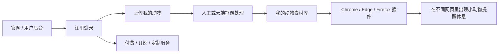
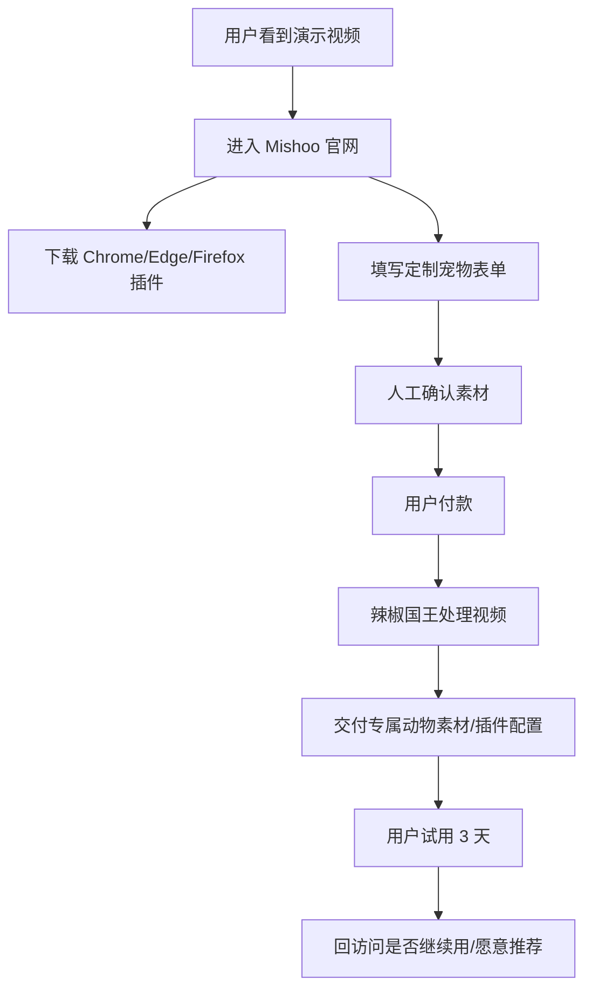

# Mishoo / 咪咻 极简商业化执行手册（历史方案）

> **已废弃：** 本文保留的是 2026-07-11 的人工/半人工验证思路，不再作为当前执行方案。2026-07-30 起，Mishoo 采用无人工交付的自动上传、抠像、质检、同步与下载路线；请以 `docs/mishoo-commercialization-and-overseas-growth-2026.md` 为准。

> 版本：2026-07-11  
> 项目：Mishoo / 咪咻  
> 品牌方：辣椒国王  
> 方法来源：已安装的 `slavingia/skills` 商业化技能组，包括 find-community、validate-idea、mvp、processize、first-customers、pricing、marketing-plan、grow-sustainably、company-values、minimalist-review。

---

## 0. 一句话结论

**Mishoo 现在最值得商业化的切入口，不是“做一个更复杂的番茄钟”，而是“让用户把自己的宠物/喜欢的角色变成会在浏览器里出来提醒休息的小动物”。**

原因很简单：

- 普通休息提醒工具很多，用户很容易说“我知道了，但我不想装”。
- 但“我的猫猫狗狗会从网页下面爬出来叫我休息”，情绪价值更强，更容易让用户愿意试、愿意分享、愿意付费。
- 当前上传视频自动抠像能力还没有完全稳定，所以最小商业化版本不应该一上来就做全自动 AI 后台，而应该先做 **人工/半人工定制服务**：用户上传视频，辣椒国王帮他处理成透明小动物素材，再同步到插件。

最终产品形态建议是：



**官网负责商业化，插件负责出现在用户正在看的网页上。**

---

## 1. 当前项目状态速览

当前项目已经具备这些商业化基础：

- 官网首页已经有多浏览器下载区域。
- 已有 Chrome / Edge / Firefox 测试包下载入口。
- Safari / macOS 版本已做“即将支持”的产品预期。
- 官网已经有“上传我的动物”入口和本地预览。
- 已经有 AI 视频 Prompt 指南，提示用户生成适合抠像的视频。
- 插件可以在普通网页注入小动物休息遮罩。
- 当前上传入口是演示版：只在本地预览，不会真正上传到服务器。

当前项目里和商业化相关的重要文件：

```text
/Users/dengyuchen.6/Desktop/Mishoo/src/App.tsx
/Users/dengyuchen.6/Desktop/Mishoo/src/styles.css
/Users/dengyuchen.6/Desktop/Mishoo/scripts/package-browsers.mjs
/Users/dengyuchen.6/Desktop/Mishoo/docs/commercialization-and-browser-roadmap.md
/Users/dengyuchen.6/Desktop/Mishoo/docs/animal-video-extraction-and-extension.md
/Users/dengyuchen.6/Desktop/Mishoo/docs/chrome-extension-user-guide.md
/Users/dengyuchen.6/Desktop/Mishoo/public/downloads/mishoo-chrome-extension.zip
/Users/dengyuchen.6/Desktop/Mishoo/public/downloads/mishoo-edge-extension.zip
/Users/dengyuchen.6/Desktop/Mishoo/public/downloads/mishoo-firefox-extension.zip
```

---

# 第一部分：10 个商业化 Skill 跑出来的结果

---

## 2. Skill 1：Find Community / 先找社区，不先幻想大市场

### 核心判断

Mishoo 不应该一开始面向“所有电脑用户”。这个范围太大，话术会散，获客会贵，用户也不会觉得“这东西是给我做的”。

建议先服务 3 类小社区。

### 社区 A：宠物主人 + 晒宠人群

| 项目 | 判断 |
| --- | --- |
| 社区 | 猫狗宠物主人、晒宠用户、宠物博主、小红书/抖音/B站晒宠人群 |
| 持续问题 | 很多人想把宠物做成头像、贴纸、表情包、桌面挂件，但门槛高；如果能把自家宠物变成“会动的休息守护兽”，情绪价值很强。 |
| Mishoo 连接点 | 产品本身就是宠物陪伴和休息提醒，和晒宠文化天然匹配。 |
| 他们在哪里 | 小红书、抖音、B站、微信群、猫狗社群、宠物医院/宠物店私域、微博超话。 |
| 商业潜力 | 强。更愿意为“我的宠物”付费，而不是为“一个通用番茄钟”付费。 |

**推荐优先级：最高。**

原因：这个社区最容易被“自家宠物变成浏览器小精灵”打动，也最适合做短视频传播。

### 社区 B：久坐办公 / 远程工作 / 设计师 / 程序员 / 内容创作者

| 项目 | 判断 |
| --- | --- |
| 社区 | 每天电脑前 6 小时以上的人，尤其是远程办公、设计师、程序员、剪辑师、写作者。 |
| 持续问题 | 普通休息提醒太无聊，通知来了会被顺手关掉；久坐、眼干、肩颈不舒服，但缺少一个“真的能打断我”的方式。 |
| Mishoo 连接点 | Mishoo 的 Pawse Mode 正好是“温柔但有点强制”的休息机制。 |
| 他们在哪里 | X/Twitter、即刻、掘金、V2EX、少数派、Product Hunt、设计师社群、远程工作社群。 |
| 商业潜力 | 中高。能付费，但需要证明比 Stretchly、番茄钟、系统提醒更有效。 |

**推荐优先级：高。**

原因：这是实际使用频次最高的人群，也是长期订阅最可能成立的人群。

### 社区 C：ADHD / 专注 / 番茄钟 / 自我管理工具用户

| 项目 | 判断 |
| --- | --- |
| 社区 | 用番茄钟、Forest、Notion 模板、习惯打卡、专注工具的人。 |
| 持续问题 | 工具很多，但坚持很难；传统提醒缺少情绪反馈和轻微“打断力”。 |
| Mishoo 连接点 | 小动物提醒比普通通知更有人格感，可能更适合需要外部提醒的人。 |
| 他们在哪里 | Reddit 相关板块、Discord、豆瓣小组、即刻、效率工具社区、小红书学习/自律内容。 |
| 商业潜力 | 中等。用户多，但部分人价格敏感，需要谨慎描述，避免医疗化承诺。 |

**推荐优先级：中。**

原因：可以作为内容方向和功能灵感来源，但不要一开始用“治疗 ADHD”之类高风险表述。

### 社区优先级结论

Mishoo 第一阶段应该这样排：

1. **宠物主人：用定制宠物服务收第一笔钱。**
2. **久坐办公人群：用插件休息提醒验证长期使用。**
3. **专注工具用户：作为内容扩散和功能反馈来源。**

---

## 3. Skill 2：Validate Idea / 验证想法，不要先把后台全搭完

### 需要验证的不是“能不能做”

Mishoo 技术上能继续往下做，但商业化真正要验证的是：

> 用户是否愿意为了“自己的宠物出现在浏览器里提醒休息”付钱？

### 当前问题定义

| 问题 | 具体描述 |
| --- | --- |
| 谁有这个问题 | 久坐办公的宠物主人、每天在浏览器里工作的人、喜欢可爱陪伴型工具的人。 |
| 他们现在怎么解决 | 系统闹钟、番茄钟、Stretchly、Apple Watch、Forest、桌面宠物、浏览器插件提醒。 |
| 现有方案哪里不爽 | 太冷冰冰、容易被关掉、没有情绪价值、不是“我的宠物”。 |
| 是否痛到愿意付费 | 通用休息提醒：付费意愿一般；自定义宠物：付费意愿更强。 |

### 验证结论

**结论：Needs more validation / 值得继续，但不能假装已经被市场验证。**

Mishoo 有明显的“哇，好可爱”传播点，但“可爱”不等于“付费”。现在最该做的是收小额定制费，验证真实付款。

### 7 天验证目标

在 7 天内完成下面这些事：

- 找 10 个每天电脑工作 6 小时以上的人聊。
- 其中至少 5 个是宠物主人。
- 给他们看当前官网、插件演示、熊猫/狗狗/猫猫素材。
- 问他们是否愿意上传自己的宠物视频。
- 直接给出价格：例如 19 元、39 元、99 元三个档。
- 目标是拿到至少 3 个真实付费或明确预订。

### 访谈问题

不要问“你觉得这个酷不酷”，因为大家都会礼貌说酷。

应该问：

1. 你现在有没有用任何休息提醒工具？为什么用/为什么不用？
2. 普通通知提醒你休息，你会理它吗？
3. 如果是你自己的猫/狗从网页里爬出来，你会不会更愿意停一下？
4. 你愿意为了把自己的宠物做进去付多少钱？
5. 如果今天就能帮你做，你愿意现在发视频/照片给我吗？
6. 你更想一次性付费，还是订阅会员？
7. 你最担心什么：隐私、安装麻烦、效果不好、还是打扰工作？

### 是否通过验证的标准

| 信号 | 判断 |
| --- | --- |
| 10 人里 3 人愿意付费 | 可以进入手工定制 MVP。 |
| 10 人里 5 人愿意安装插件试用 3 天 | 插件体验值得继续优化。 |
| 只有人说“可爱”，没人愿意上传/付费 | 说明只是玩具，不是业务。 |
| 用户强烈要求“放我的宠物进去” | 定制宠物是主卖点。 |
| 用户主要问“能不能别太打扰” | 需要加强可控性和安全退出体验。 |

---

## 4. Skill 3：MVP / 最小可卖版本

### 不要做成什么

第一版商业化不要做成这些：

- 不要立刻做完整账号系统。
- 不要立刻做全自动 AI 抠像队列。
- 不要立刻做复杂订阅后台。
- 不要立刻做 Safari 原生 App。
- 不要立刻做素材商城、积分、社区、排行榜。

这些以后都能做，但现在最重要的是先证明有人付费。

### Mishoo 最小可卖版本

**MVP 只做一件事：用户付费后，把自己的宠物变成浏览器里会提醒休息的小动物。**

### 周末可交付版本

只需要这些：

1. 官网保留 Chrome / Edge / Firefox 下载按钮。
2. 官网新增或强化“上传我的动物 / 加入定制排队”表单入口。
3. 表单收集：
   - 邮箱/微信
   - 宠物名字
   - 宠物视频或网盘链接
   - 想要的动作：爬出来、走出来、跳出来、趴下、坐下
   - 浏览器类型
   - 是否愿意付费
4. 收款可以先用手工方式：微信/支付宝/Stripe/Gumroad 任一即可。
5. 你手工处理视频，交付一个定制版素材或定制版插件配置。
6. 让用户安装插件，试用 3 天。
7. 3 天后收反馈。

### 第一版不要追求自动化

第一批 10 个客户可以全部人工处理。即使每个用户要花 30-60 分钟，也值得，因为你会学到：

- 用户上传的视频到底有多糟糕。
- 用户看不懂哪些安装步骤。
- 用户真正想要的是“休息提醒”还是“宠物陪伴”。
- 抠像最常见的问题是绿幕、字幕、水印、边缘、阴影还是动物太小。
- 用户愿意为哪种效果付更多钱。

### MVP 定义

| 项目 | 内容 |
| --- | --- |
| 单一价值 | 把用户自己的宠物做成可在浏览器网页中出现的休息守护兽。 |
| 实现方式 | 官网收集需求 + 人工/半人工视频处理 + 插件播放。 |
| 交付物 | 一个可用的浏览器插件包 + 用户自己的动物素材。 |
| 首版价格 | 19-39 元尝鲜价，复杂视频 99 元起。 |
| 反馈方式 | 微信/邮件 3 天回访，问使用次数、是否烦、是否愿意推荐。 |

---

## 5. Skill 4：Processize / 先流程化，再产品化

### 一句话人工服务描述

> 用户上传宠物视频，辣椒国王在 24-48 小时内帮他处理成透明背景的小动物素材，并配置到 Mishoo 浏览器插件里，让宠物在网页上出来提醒他休息。

### Magic Piece of Paper：手工交付流程

这就是第一阶段的“魔法小纸条”。先照着它做 10 单，再决定哪些环节需要自动化。

#### 触发条件

用户在官网点击“上传我的动物”，提交表单并付款或预约。

#### 用户需要给什么

- 邮箱或微信。
- 宠物名字。
- 宠物视频，建议 5-12 秒。
- 如果没有视频，可以给 AI 生成 Prompt 或帮用户生成。
- 用户浏览器类型：Chrome / Edge / Firefox。
- 用户想要的动作：从下方爬出、从旁边走出、坐下、趴下、吃竹子、挥手等。

#### 内部处理步骤

1. 查看订单和素材。
2. 判断视频是否可处理：
   - 动物是否完整。
   - 背景是否干净。
   - 有没有水印、字幕、豆包 AI 字样。
   - 竹子/草地等绿色物体是否会被绿幕误抠。
3. 如果素材不合格，给用户发重传建议。
4. 如果素材合格，进入处理：
   - 裁剪时长。
   - 去除水印/文字区域，必要时裁切画面。
   - 抠背景。
   - 边缘羽化。
   - 输出透明 WebM 或备用 PNG 序列/GIF。
   - 压缩体积。
5. 在本地插件里测试：
   - 普通白色网页。
   - 深色网页。
   - 复杂网页背景。
   - 动物边缘是否发绿/发蓝。
   - 是否出现“动物也被抹没”的情况。
6. 生成预览图或录屏。
7. 发给用户确认。
8. 确认后交付：
   - 发送插件下载链接或更新用户素材包。
   - 发送安装教程。
   - 告诉用户如何调休息时间。
9. 3 天后回访。

#### 工具清单

| 环节 | 可用工具 |
| --- | --- |
| 收集需求 | 官网表单、Tally、飞书表格、Google Forms、Airtable |
| 收款 | 微信、支付宝、Stripe、Gumroad、Lemon Squeezy |
| 文件上传 | 官网后端、飞书、Google Drive、阿里云 OSS、S3 |
| 视频处理 | FFmpeg、当前项目脚本、剪映、Runway、RVM/backgroundremover、After Effects |
| 客服回访 | 微信、邮件、飞书多维表格 |
| 状态跟踪 | Notion、Airtable、飞书表格 |

#### 每单预计耗时

| 阶段 | 时间 |
| --- | --- |
| 看素材与回复 | 5-10 分钟 |
| 视频裁切/去水印/抠像 | 20-60 分钟 |
| 插件测试 | 10-15 分钟 |
| 交付和教程 | 5-10 分钟 |
| 回访 | 5 分钟 |

第一阶段每单预计 **45-90 分钟**。如果低价单太耗时，说明要么涨价，要么限制上传素材质量。

### 什么时候开始自动化

满足下面条件再做完整后台：

- 已交付 10 个付费用户。
- 至少 5 个用户 3 天后还在用。
- 用户重复问的问题已经稳定。
- 视频处理步骤连续 2 周没有大变化。
- 每周手工处理时间超过 8 小时。

第一优先自动化的环节：**上传表单 + 订单队列 + 素材状态管理**。  
第二优先自动化的环节：**视频初筛和格式校验**。  
第三优先自动化的环节：**AI 抠像处理队列**。

---

## 6. Skill 5：First Customers / 前 100 个客户怎么来

### 不要先“大发布”

Mishoo 现在不需要先搞一个盛大的发布。应该先一个个卖，卖到 100 个付费用户后，再把发布当成庆祝。

### 第一圈：朋友、同事、熟人

目标：10 个试用，3 个付费。

建议找这些人：

1. 有猫/狗/兔子/仓鼠的人。
2. 每天坐电脑前很久的人。
3. 设计师/程序员/运营/剪辑/写作者。
4. 经常说自己肩颈痛、眼干、熬夜的人。
5. 喜欢可爱工具、桌面小组件、Notion 模板的人。

邀请话术：

> 我在做一个很欠揍但很可爱的浏览器插件：到点了，你的宠物会从网页下面爬出来提醒你休息。现在可以帮你把自家猫猫狗狗做进去，我想找前 10 个真实用户试一下。你愿不愿意发我一段 5-10 秒宠物视频？我帮你做一个专属版本，做好你试 3 天，告诉我它到底是可爱还是烦人。

### 第二圈：你已经能接触到的社区

目标：30 个试用，10 个付费。

可发的地方：

- 小红书：宠物、桌面好物、打工人休息、AI 工具。
- 即刻：独立开发、效率工具、宠物、AI 产品。
- V2EX / 掘金：程序员久坐、浏览器插件、独立开发。
- B站/抖音：录屏展示“我的狗从网页里出来让我休息”。
- 朋友圈/微信群：第一批种子用户。

内容不要像广告，要像实验：

> 我做了个小东西，想测试一件事：如果提醒你休息的不是闹钟，而是你自己的狗，会不会更有用？现在免费/低价帮前 10 个宠物主人做专属浏览器小动物，要求是愿意认真反馈。

### 第三圈：陌生用户冷启动

目标：100 个付费用户。

冷私信模板：

> 你好，我看到你经常分享你家【宠物名字/猫猫狗狗】。我在做一个叫 Mishoo 的小插件，可以把宠物做成会在浏览器网页里出现的休息提醒小动物。  
> 不是那种普通番茄钟，是“你的宠物从屏幕下面出来劝你休息”。  
> 我现在在找前 20 个测试用户，可以帮你做一个专属版本。你只需要给我一段 5-10 秒宠物视频，做好后你试 3 天，觉得有用再付费/或者现在给一个早鸟价。  
> 如果你感兴趣，我可以发你一个 20 秒演示视频。

### 周销售目标

| 周数 | 目标 |
| --- | --- |
| 第 1 周 | 10 次访谈，3 个付费/预订。 |
| 第 2 周 | 交付 5 个定制宠物，拿到 3 条可引用反馈。 |
| 第 3 周 | 通过内容和私信拿到 20 个试用。 |
| 第 4 周 | 累计 15-20 个付费用户，决定是否做后台。 |
| 第 2 个月 | 累计 50 个付费用户。 |
| 第 3 个月 | 累计 100 个付费用户，再考虑正式发布。 |

### 销售记录表字段

建议建一个表格，字段如下：

```text
姓名/昵称
联系方式
来源渠道
是否宠物主人
每天电脑工作时长
是否安装插件
是否上传宠物素材
报价档位
是否付款
交付日期
3 天后是否还在用
最大问题
是否愿意推荐
备注
```

---

## 7. Skill 6：Pricing / 定价策略

### 定价原则

Mishoo 不建议完全免费。免费用户会给很多“好可爱”的反馈，但很难告诉你这个产品有没有商业价值。

建议采用 **免费插件 + 付费定制 + 未来订阅** 的混合模式。

### 第一阶段价格：验证付费

| 档位 | 价格 | 内容 | 适合人群 |
| --- | ---: | --- | --- |
| 免费版 | 0 元 | 使用内置小动物，基础休息提醒，多浏览器插件下载。 | 普通体验用户、传播入口。 |
| 早鸟定制版 | 19 元 | 用户提供合格视频，人工处理一次，交付一个专属宠物素材。 | 前 20 个种子用户，主要为了验证。 |
| 标准定制版 | 39-59 元 | 人工处理 + 安装指导 + 一次修改。 | 宠物主人主力档。 |
| 高级定制版 | 99-199 元 | 视频较复杂、需要去水印/去字幕/精修边缘/多动作。 | 想要更好效果的用户、宠物博主。 |
| 未来会员 | 9-19 元/月 | 多设备同步、多个宠物、更多动作、云端素材库。 | 高频办公用户。 |

### 为什么自定义宠物应该收费

因为用户买的不是“视频抠像”，而是：

- 把自己的宠物带进工作场景。
- 让休息提醒更难被无视。
- 得到一个可分享、可炫耀的小东西。
- 省掉自己研究绿幕、抠像、插件配置的麻烦。

### 粗略成本模型

假设第一阶段人工处理：

- 每单平均 60 分钟。
- 早鸟 19 元只能验证兴趣，不适合长期服务。
- 标准 59 元更合理。
- 高级 99 元以上才覆盖复杂处理时间。

所以建议：

1. 前 20 单可以 19 元，目的是换反馈和案例。
2. 一旦有人愿意付，立刻涨到 39-59 元。
3. 如果用户视频素材复杂，直接报价 99 元起。
4. 不要承诺所有视频都能做，要写清楚“素材越干净，效果越好”。

### 财务目标示例

如果月目标是 10,000 元收入：

| 模式 | 单价 | 所需客户 |
| --- | ---: | ---: |
| 定制服务 | 59 元/单 | 约 170 单/月 |
| 高级定制 | 199 元/单 | 约 51 单/月 |
| 会员订阅 | 15 元/月 | 约 667 人 |
| 混合模式 | 50 个高级定制 + 100 个会员 | 接近 11,450 元/月 |

早期更现实的是靠定制服务获得第一批收入，订阅等使用习惯验证后再推。

### 什么时候涨价

满足任意两个条件就涨价：

- 交付排队超过 7 天。
- 付费转化率超过 30%。
- 用户主要夸“值得”，而不是主要嫌贵。
- 复杂视频处理占比变高。
- 案例和口碑已经能展示。

---

## 8. Skill 7：Marketing Plan / 极简营销计划

### 现在不是投广告的时候

Mishoo 现在还没证明 100 个付费用户，不建议投广告。先用内容和一对一销售。

### 主阵地建议

第一阶段建议只重点做两个内容阵地：

1. **小红书 / 抖音：负责宠物和可爱传播。**
2. **即刻 / X / V2EX：负责独立开发和效率工具反馈。**

不要一开始铺 8 个平台，会累死，而且每个平台都做不好。

### 内容漏斗

| 阶段 | 用户心理 | 内容目的 |
| --- | --- | --- |
| 看到 | “这是什么，好可爱。” | 短视频展示宠物从网页爬出来。 |
| 关注 | “这人还会继续更新吗？” | 连续展示不同动物/角色案例。 |
| 研究 | “我能不能把自己的宠物也做进去？” | 官网、FAQ、安装教程、上传要求。 |
| 考虑 | “贵不贵，麻不麻烦？” | 价格、交付时间、效果对比。 |
| 购买 | “我要试一下。” | 早鸟名额、表单、付款、客服。 |

### 内容主题：Educate / Inspire / Entertain

#### Educate：教用户怎么做

1. “想把宠物做成浏览器小动物，视频应该怎么拍？”
2. “为什么熊猫拿竹子不能用绿幕？因为竹子会被一起抠没。”
3. “AI 生成动物视频时，一定要写：不要文字、不要水印、不要字幕。”
4. “Chrome 插件怎么本地安装？普通人版教程。”
5. “透明背景 WebM、GIF、绿幕到底有什么区别？”

#### Inspire：讲产品过程

1. “我为什么做了一个会强制你休息的小动物？”
2. “第一次把自家宠物放进浏览器，我笑了 3 分钟。”
3. “一个插件从只能在网站用，到能在不同网页里用。”
4. “我们为了抠掉豆包 AI 水印，和视频边缘打了一架。”
5. “做 AI 产品最真实的一天：动物没了，背景也没了。”

#### Entertain：让用户愿意转发

1. “老板：你怎么突然不动了？我：我的狗让我休息。”
2. “当你的猫开始管理你的工时。”
3. “普通番茄钟：叮。Mishoo：朕命令你立刻休息。”
4. “别人的 AI：改变世界。我的 AI：让熊猫出来啃竹子。”
5. “狗狗从网页下面爬出来的那一刻，我宣布今天不加班。”

### 邮件/私域策略

官网应该尽快收集邮箱或微信，给用户一个理由：

- 领取《把宠物做成 Mishoo 小动物的视频拍摄指南》
- 加入前 100 个内测名额
- 免费获得 3 个 AI 动物视频 Prompt 模板
- 获取 Chrome / Edge / Firefox 插件更新提醒

邮件/私域不是为了群发广告，而是为了：

- 通知新动物上线。
- 召回用户安装新版插件。
- 收集上传素材。
- 回访付费用户。

---

## 9. Skill 8：Grow Sustainably / 可持续增长

### 不要一上来烧钱

Mishoo 第一阶段最大成本应该是时间，而不是钱。

不建议现在做：

- 购买大量广告。
- 招全职员工。
- 租办公室。
- 购买昂贵 GPU 长期服务器。
- 一次性做完整 SaaS 后台。

建议现在做：

- 用现有项目官网承接下载和上传意向。
- 用表格管理订单。
- 用人工处理第一批视频。
- 用免费内容获客。
- 用客户付款补贴工具成本。

### 成本控制原则

| 成本 | 建议 |
| --- | --- |
| 服务器 | 第一阶段不需要重后端；表单 + 文件网盘即可。 |
| AI 抠像 | 先本地/手工处理；付费单稳定后再上云队列。 |
| 客服 | 创始人自己做，越早越应该亲自听用户吐槽。 |
| 设计 | 用现有官网继续迭代，不要重做品牌大工程。 |
| 上架商店 | Chrome/Edge/Firefox 逐步来；Safari 等验证后再投入。 |

### 避免 burnout 的规则

- 每周最多接固定数量的人工定制单，比如 10 单。
- 明确写清楚交付时间：24-48 小时，不要承诺“马上”。
- 复杂素材要么加钱，要么拒绝，不要硬做。
- 每周固定一天复盘，不要天天改方向。
- 功能优先级只听付费用户，不听围观群众“要不你加个 XXX”。

### 默认活着的路径

第一阶段收入目标不要夸张：

- 第 1 个月：验证 15-20 个付费用户。
- 第 2 个月：做到 50 个付费用户。
- 第 3 个月：做到 100 个付费用户。
- 第 4 个月后：再判断是否投入云端自动化和会员订阅。

这样比较小，但活得久。活得久，才有机会长大。

---

## 10. Skill 9：Company Values / 辣椒国王的产品价值观

这里给 Mishoo / 辣椒国王草拟 5 条价值观，后面可以放进团队文档、官网 About 页面、招聘说明。

### 价值观 1：可爱不是装饰，可爱是生产力

**解释：**  
我们不是为了“萌”而萌。Mishoo 的可爱要服务于一个真实目标：让用户更愿意休息、更愿意照顾自己。

**日常体现：**

- 做动效时，不只问“可不可爱”，还要问“用户会不会真的停下来”。
- 文案可以幽默，但不能让用户看不懂。
- 小动物可以调皮，但不能让用户觉得被绑架。

**招聘/合作判断：**

- 喜欢把体验做得有情绪价值的人适合。
- 只会堆炫技、不关心用户感受的人不适合。

**反模式：**

- 为了可爱牺牲可用性。
- 动效太吵、太遮挡、太难退出。

### 价值观 2：用户安全感比强制感更重要

**解释：**  
休息提醒可以坚定，但不能吓人。用户必须知道自己随时能退出、能控制、能卸载。

**日常体现：**

- 任何 Pawse Mode 都保留明确退出按钮。
- 不读取屏幕、不偷偷上传、不碰摄像头。
- 插件权限尽量少，隐私说明说人话。

**招聘/合作判断：**

- 对权限、隐私、安全边界敏感的人适合。
- 觉得“为了增长可以多拿点权限”的人不适合。

**反模式：**

- 暗中收集用户页面内容。
- 故意让用户难以退出。
- 用恐吓式健康文案逼用户付费。

### 价值观 3：先手工让 10 个人开心，再自动化让 1000 个人开心

**解释：**  
不要为了假想中的百万用户，把后台搭成航空母舰。先把第 1 个、第 10 个用户服务好。

**日常体现：**

- 第一批视频可以人工处理。
- 先用表格管理订单。
- 用户重复问 10 次的问题，才值得做成产品功能。

**招聘/合作判断：**

- 愿意亲自做客服、做脏活的人适合。
- 只想设计“大平台架构”但不愿意服务第一个用户的人不适合。

**反模式：**

- 没有付费用户就做复杂会员系统。
- 没有订单就租 GPU 服务器。

### 价值观 4：透明到用户能放心把宠物交给我们

**解释：**  
宠物视频是用户很私人的东西。我们要告诉用户会怎么处理、保存多久、能不能删除。

**日常体现：**

- 上传页写清楚素材用途。
- 商业版提供删除素材入口。
- 失败也说清楚原因，不装神秘 AI。

**招聘/合作判断：**

- 愿意把复杂技术解释给普通用户的人适合。
- 喜欢用黑箱和术语糊弄用户的人不适合。

**反模式：**

- “AI 自动处理失败”但不给解释。
- 用户想删素材却找不到入口。

### 价值观 5：小团队也要有辣味

**解释：**  
辣椒国王做的产品应该有记忆点，不做一杯温吞水。幽默、锋利、好玩，但不冒犯用户。

**日常体现：**

- 用户文档可以像朋友说话。
- FAQ 可以幽默，但答案要靠谱。
- 产品可以小，但必须有性格。

**招聘/合作判断：**

- 能写出“人话”的人适合。
- 只会写“尊敬的用户您好”的人需要再腌一腌。

**反模式：**

- 为了搞笑牺牲清晰。
- 品牌语气过度卖萌，让用户觉得不专业。

---

## 11. Skill 10：Minimalist Review / 极简创业视角总复盘

### 明确建议

**建议继续做，但要大幅简化商业化路径：先卖定制宠物服务，不要先做完整 SaaS 平台。**

### 当前计划的优点

- 产品有明显视觉传播点。
- 官网和插件雏形已经具备。
- 多浏览器下载路径已经开始搭建。
- 自定义动物上传是正确方向。
- 用户安装文档已经开始准备，降低普通用户门槛。

### 最大风险

| 风险 | 说明 | 解决方式 |
| --- | --- | --- |
| 技术风险 | 抠像效果不稳定，动物可能被抹没、背景发绿、边缘脏。 | 不承诺全自动；先人工筛素材；提供拍摄/生成规范。 |
| 付费风险 | 用户觉得可爱但不付钱。 | 立刻做早鸟付费测试。 |
| 安装风险 | 普通用户不会装开发者模式插件。 | 先服务愿意折腾的早期用户；尽快上 Chrome/Edge 商店。 |
| 隐私风险 | 用户担心上传宠物/屏幕数据。 | 明确说明不读取页面内容，上传素材仅用于生成小动物。 |
| 范围风险 | 想同时做网站、后台、AI、商城、全浏览器、移动端。 | 只做“上传宠物 → 交付浏览器小动物”这一条链路。 |

### 最小版本应该长这样



### 本周只做一件事

**把官网“上传我的动物”从演示入口升级成“早鸟定制排队入口”。**

不用先接复杂后端，可以先：

- 放一个清晰 CTA。
- 接一个表单链接。
- 写清楚早鸟价格。
- 写清楚视频要求。
- 写清楚交付时间。
- 写清楚不满意如何处理。

---

# 第二部分：30 天执行计划

---

## 12. 第 1 周：卖前 3 单

目标：验证是否有人愿意付钱。

### 要做的事

- 准备 2-3 个演示案例：狗狗、熊猫、猫猫/兔兔。
- 录一个 20-30 秒演示视频。
- 官网上传区改成“加入早鸟定制”。
- 发给 10 个熟人/宠物主人。
- 做 10 次短访谈。
- 尝试收 3 个 19 元/39 元早鸟单。

### 不要做的事

- 不要做完整登录系统。
- 不要做自动付款回调。
- 不要做 AI 队列。
- 不要上来买广告。

### 第 1 周通过标准

- 至少 3 人愿意付费或预订。
- 至少 5 人愿意安装插件试用。
- 至少 3 人愿意上传自己的宠物视频。

---

## 13. 第 2 周：交付前 5 个定制宠物

目标：验证交付流程和效果。

### 要做的事

- 手工处理 5 个用户视频。
- 记录每个视频的问题。
- 总结素材要求：什么视频好处理，什么视频不行。
- 给每个用户发安装教程。
- 3 天后回访。

### 重点观察

- 用户能不能装上插件。
- 插件能不能在他们常用网页里出现。
- 小动物会不会太打扰。
- 用户是否愿意继续用。
- 用户是否愿意发朋友圈/小红书。

---

## 14. 第 3 周：内容获客 + 价格测试

目标：从熟人圈走向小社区。

### 要做的事

- 发布 5 条内容：
  - 2 条可爱演示。
  - 1 条制作过程。
  - 1 条视频拍摄指南。
  - 1 条安装教程。
- 早鸟价格从 19 元提高到 39 元。
- 对复杂视频报价 99 元。
- 收集 20 个上传意向。

### 判断点

如果 39 元也有人付，说明有基础价值。  
如果只要免费才有人要，说明需要重新定位或加强交付效果。

---

## 15. 第 4 周：决定是否做后台

目标：用真实数据决定下一步。

### 复盘问题

1. 是否累计 15-20 个付费/预订用户？
2. 是否有 5 个用户 3 天后仍在使用？
3. 用户最爱的是休息提醒，还是宠物陪伴？
4. 用户最大卡点是安装、上传、视频效果，还是价格？
5. 人工处理流程是否已经稳定？

### 如果数据好

开始做商业版后台 MVP：

- 登录。
- 上传视频。
- 订单状态。
- 人工处理后台。
- 素材库。
- 插件同步。

### 如果数据一般

不要硬做后台。继续调整：

- 换社区。
- 换价格。
- 强化视频效果。
- 简化安装。
- 改成“宠物桌面陪伴”而不是“休息提醒”。

---

# 第三部分：90 天路线图

---

## 16. 0-30 天：人工验证期

| 模块 | 目标 |
| --- | --- |
| 官网 | 下载入口 + 早鸟上传表单 + FAQ + 案例展示。 |
| 插件 | Chrome/Edge/Firefox 测试包可用。 |
| 视频处理 | 人工/半人工处理，保证效果。 |
| 商业 | 收 15-20 个付费用户。 |
| 内容 | 产出 10-15 条演示和教程内容。 |

## 17. 31-60 天：半自动交付期

| 模块 | 目标 |
| --- | --- |
| 官网 | 表单接入数据库，用户可查看订单状态。 |
| 账号 | 简单邮箱登录或 magic link。 |
| 上传 | 支持真实上传到云存储。 |
| 后台 | 管理订单、下载素材、上传处理结果。 |
| 插件 | 支持从远程配置拉取用户素材。 |
| 商业 | 累计 50 个付费用户。 |

## 18. 61-90 天：产品化准备期

| 模块 | 目标 |
| --- | --- |
| 支付 | 接 Stripe/支付宝/微信等正式支付。 |
| AI 处理 | 自动初筛 + 半自动抠像队列。 |
| 素材库 | 用户可管理多个动物。 |
| 商店 | 准备 Chrome Web Store / Edge Add-ons / Firefox Add-ons 上架。 |
| 订阅 | 测试 9-19 元/月会员。 |
| 商业 | 累计 100 个付费用户。 |

---

# 第四部分：网站、插件、后台的商业化架构

---

## 19. 为什么必须有网站承接

插件可以登录，也可以上传，但商业化主阵地应该是网站，因为：

- 用户更容易在网站理解产品和价格。
- 大文件上传、视频处理、订单状态更适合网站。
- 支付和客服更适合网站。
- SEO 和内容营销需要网站。
- 插件商店审核不适合承载复杂商业逻辑。

### 分工建议

| 能力 | 官网/后台 | 插件 |
| --- | --- | --- |
| 注册登录 | 主负责 | 登录同步即可 |
| 上传动物视频 | 主负责 | 可放入口，跳转官网 |
| 支付 | 主负责 | 不建议放复杂支付 |
| 素材库 | 主负责 | 读取和缓存素材 |
| 动物播放 | 预览 | 主负责 |
| 休息计时 | 可配置 | 主负责 |
| 多网页显示 | 做不到 | 主负责 |

## 20. 后台 MVP 数据结构

后面真正做网站后台时，最小数据结构可以是：

```text
User
- id
- email
- displayName
- plan
- createdAt

AnimalOrder
- id
- userId
- petName
- sourceVideoUrl
- browserType
- requestedAction
- status: submitted / reviewing / need_resubmit / processing / ready / delivered / failed
- price
- paidAt
- notes
- createdAt

AnimalAsset
- id
- userId
- orderId
- name
- previewImageUrl
- transparentVideoUrl
- fallbackGifUrl
- configJson
- createdAt

ExtensionDevice
- id
- userId
- browser
- extensionVersion
- lastSyncedAt
```

## 21. 插件同步逻辑

商业版插件应该这样工作：

1. 用户在官网登录并上传动物。
2. 后台处理完成后，生成 `AnimalAsset`。
3. 插件登录同一账号。
4. 插件拉取用户动物列表。
5. 插件缓存透明视频素材。
6. 到点后在当前网页播放用户选择的小动物。

---

# 第五部分：当前官网可以立刻改的文案

---

## 22. 上传入口文案建议

标题：

> 上传我的动物，让它亲自来抓我休息

副标题：

> 猫猫狗狗、熊猫兔兔、甚至你 AI 生成的小怪兽都可以。上传 5-12 秒视频，辣椒国王会把它处理成透明背景的小动物，让它在浏览器网页里出来提醒你休息。

按钮：

> 加入早鸟定制排队

价格提示：

> 前 20 位早鸟用户 19 元起，复杂视频会先人工评估，不会让你花冤枉钱。放心，我们不是绿幕刺客。

素材要求：

- 动物尽量完整。
- 背景尽量纯色。
- 不要字幕、水印、贴纸。
- 如果动物拿着竹子、树叶等绿色物体，不要用绿幕，建议蓝幕或紫幕。
- 视频 5-12 秒最好。

## 23. FAQ 文案建议

**Q：我上传的视频会被公开吗？**  
A：不会。默认只用于给你生成专属小动物素材。如果以后想展示案例，会先问你，绝不偷宠出道。

**Q：所有视频都能处理吗？**  
A：不保证。动物太小、背景太乱、字幕水印太多、和背景颜色太像，都会影响效果。我们会先人工看素材，能做再做。

**Q：为什么竹子熊猫不能用绿幕？**  
A：因为竹子也是绿色，绿幕一抠，熊猫可能还在，竹子先没了；严重时熊猫边缘也会被误伤。建议用蓝幕/紫幕。

**Q：插件能在所有网页用吗？**  
A：大多数普通网页可以。但浏览器内置页面，比如 `chrome://`、扩展商店、新标签页等，浏览器不让插件注入，这不是咪咻偷懒，是浏览器保安比较严格。

**Q：Safari 呢？**  
A：Safari 通常需要 macOS App/Xcode 包装，分发方式不一样。会做，但不是第一批，先别催它，苹果生态这道菜要慢炖。

---

# 第六部分：关键决策清单

---

## 24. 现在该做

- [ ] 把官网上传入口改成早鸟定制排队入口。
- [ ] 增加一个真实表单链接或后端接口。
- [ ] 明确早鸟价格：19/39/99。
- [ ] 做 2-3 个高质量演示案例。
- [ ] 找 10 个宠物主人访谈。
- [ ] 收 3 个付费/预订单。
- [ ] 手工交付 5 个定制宠物。
- [ ] 记录所有处理问题和用户反馈。

## 25. 现在不要做

- [ ] 不要先做完整 SaaS 后台。
- [ ] 不要先做全自动 AI 抠像服务。
- [ ] 不要先做复杂会员权益。
- [ ] 不要先投广告。
- [ ] 不要先承诺支持所有浏览器。
- [ ] 不要承诺任何视频都能完美抠像。

## 26. 继续开发的优先级

| 优先级 | 功能 | 原因 |
| --- | --- | --- |
| P0 | 早鸟上传/预约表单 | 直接验证商业化。 |
| P0 | 视频素材要求和 Prompt 指南 | 降低处理失败率。 |
| P0 | 案例展示 | 让用户知道效果长什么样。 |
| P1 | 订单状态管理 | 手工单变多后必须有。 |
| P1 | 插件远程素材同步 | 商业版核心体验。 |
| P1 | Chrome/Edge 正式上架 | 降低安装门槛。 |
| P2 | 自动 AI 抠像队列 | 有订单后再自动化。 |
| P2 | 订阅会员 | 高频使用验证后再推。 |
| P3 | Safari/macOS App | 成本较高，后置。 |

---

# 第七部分：一句话战略

---

## 27. Mishoo 的极简战略

**先不要把 Mishoo 做成一个“大而全的 AI 休息平台”。**

先把它做成：

> 一个能把用户自己的宠物变成浏览器休息守护兽的小服务。

当 100 个用户愿意为这个小服务付费，再把手工流程一步步产品化：账号、上传、素材库、插件同步、自动抠像、订阅会员。

这条路虽然没有“我要做一个改变世界的 AI 平台”听起来那么宏大，但它更容易活下来。  
而且说实话，世界已经有很多宏大平台了，少一个没关系。  
但如果打工人的猫能从网页下面钻出来说“别卷了，起来喝水”，这事儿很可能真的有人愿意买单。

---

## 28. 下一步建议

如果继续推进，我建议下一个开发任务直接做：

> **把当前官网的“上传我的动物”区域升级成真实的早鸟定制入口：表单 + 价格 + 上传要求 + 订单状态说明。**

最轻实现方式：

1. 先接一个外部表单链接，不写后端。
2. 表单提交后人工联系用户。
3. 手工收款。
4. 手工处理视频。
5. 交付插件素材。
6. 等 10-20 单后，再写真正后台。
