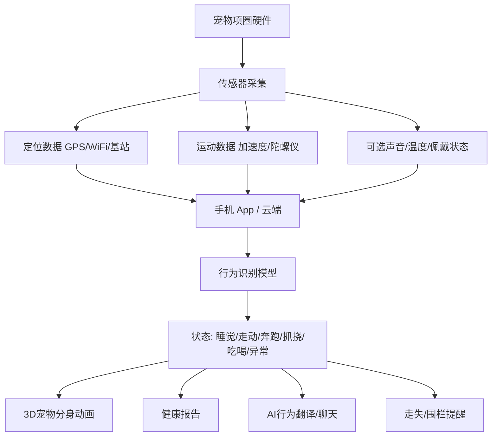
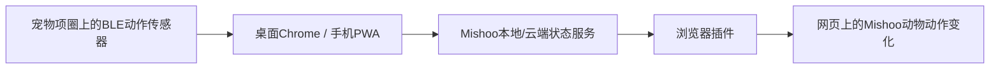

# Mishoo × 宠物智能硬件 MVP 分析：从“浏览器小动物”到“真实宠物同步”

> 版本：2026-07-11  
> 项目：Mishoo / 咪咻  
> 品牌方：辣椒国王  
> 目标：分析“宠物界 Apple Watch / 智能项圈”模式，并给 Mishoo 一个低成本硬件结合 MVP 路线。

---

## 1. 我从视频链接和截图里读到了什么

视频号链接：`https://weixin.qq.com/sph/AOgINZCjBs`

我无法像普通微信客户端那样完整播放视频号视频，但我能解析到公开预览页的元数据：

- 作者：朵拉AI梦梦
- 描述：`小咪：你的控制欲让咪窒息#小咪 #监视 #小猫项圈 #监控`
- 互动数据：收藏约 3.1 万、点赞约 1.1 万、转发约 2.9 万、评论 536
- 这是一个围绕“小猫项圈 / 监控 / 实时宠物状态”的爆款内容。

对你给的 3 张截图，我做了 OCR，核心信息如下：

### 截图 1：选择帕奇宠的 8 大理由

- GPS + WIFI 精准定位
- 3D 宠物分身，实时动态
- 健康报告分析，异常行为早发现
- 语音实时呼唤
- 家庭围栏 + 电子围栏
- AI 行为翻译：饿了？想玩？人宠聊天不用猜
- 专业宠医问诊：1 宠 1 档，终身守护
- 21g 超轻，IP68 防水

### 截图 2：语音聊天 / 行为翻译

- “人宠交流不用猜”
- 类似聊天界面，把宠物状态包装成“宠物说话”
- 提示“AI 生成仅供参考”

### 截图 3：3D 宠物分身 / 动态同步

- 3D 宠物分身，动态同步
- “它在干嘛？一键查看”
- 猫狗共 380 种皮肤和品种可选
- 桌面宠物/超写实版本规划

一句话：这个产品不是单纯卖定位器，而是在卖 **“我虽然不在宠物旁边，但我知道它在哪、在干嘛、心情怎么样”** 的安全感和陪伴感。

---

## 2. 它大概率是怎么实现的

这种“宠物界 Apple Watch”一般不是靠一个魔法 AI，而是几层技术叠在一起。



### 2.1 硬件层

常见传感器/模块：

| 模块 | 作用 |
| --- | --- |
| GPS / GNSS | 室外定位、轨迹、走失找回。 |
| Wi-Fi 定位 | 室内或城市环境辅助定位。 |
| 蜂窝网络 / NB-IoT / LTE-M / 4G | 宠物离开手机蓝牙范围后也能上传位置。 |
| 加速度计 | 判断走、跑、睡、静止、抓挠、吃喝等动作。 |
| 陀螺仪 | 判断头部/身体姿态变化，提高动作识别准确率。 |
| 蜂鸣器 / 铃声 | 响铃寻宠。 |
| 麦克风/扬声器 | 语音呼唤或环境声音，注意功耗和隐私风险。 |
| 电池 + 充电 | 最大痛点之一：重量、续航、防水三角矛盾。 |
| 防水外壳 | IP67/IP68，宠物日常佩戴必需。 |

### 2.2 行为识别层

它所谓“知道宠物在干嘛”，核心通常是：

1. 项圈采集加速度/陀螺仪数据。
2. 模型把一段时间窗口的运动信号分类。
3. 得到状态：静止、睡觉、走动、跑动、进食、饮水、抓挠、舔毛等。
4. App 把这些状态翻译成用户能理解的文案和动画。

注意：

> “AI 行为翻译”很多时候不是宠物真的说话，而是“传感器状态 + 规则/大模型文案包装”。

比如：

- 低活动 + 长时间躺着 → “我在睡觉，别吵我。”
- 高活动 + 离开围栏 → “我出去冒险啦！”
- 频繁抓挠 → “我可能有点痒，主人看看我。”
- 靠近饭点 + 活动提升 → “我是不是该吃饭啦？”

### 2.3 3D 分身同步层

“3D 宠物分身实时动态”大概率不是逐帧捕捉真实猫狗动作，而是：

| 真实数据 | 映射到虚拟宠物 |
| --- | --- |
| 静止/睡眠 | 3D 分身趴下睡觉 |
| 走动 | 3D 分身走路 |
| 跑动/高活跃 | 3D 分身跑跳 |
| 抓挠/舔毛 | 3D 分身播放抓挠/舔毛动画 |
| 离开围栏 | 分身惊慌/提醒动画 |

也就是说，它是 **状态同步**，不是电影级动作捕捉。用户感觉“实时”，产品上可以成立；但技术上更像“传感器分类 + 预设动画”。

---

## 3. 它的商业模式

### 3.1 明面收入

从淘宝/京东能看到，帕奇宠智能项圈主机价格约 799 元，另有智能喂食器、项圈带子、硅胶套、充电线等配件。

| 收入项 | 说明 |
| --- | --- |
| 硬件销售 | 项圈主机，典型价格 799 元左右。 |
| 配件销售 | 项圈带、硅胶套、充电线等，约 35 元左右。 |
| 其他硬件 | AI 双摄智能喂食器约 499 元。 |
| GPS 服务 | 有“含 1 年 GPS / 终身 GPS”等规格，说明定位服务可被包装进 SKU。 |
| 医疗/问诊 | App 描述中有 AI 智能问诊、家庭医生 1V1。 |
| 数据/会员服务 | 健康报告、行为分析、AI 互动都有订阅潜力。 |

### 3.2 真正卖的不是硬件，是三种情绪

1. **安全感**：宠物别丢。
2. **掌控感**：我知道它在哪、在干嘛。
3. **陪伴感**：它像一个会回应我的小生命，手机里/桌面上都能看到。

这点和 Mishoo 很相关。Mishoo 现在卖的是“休息提醒 + 小动物陪伴”，如果硬件化，应该借力第三点：

> 不做“更便宜的 GPS 项圈”，而做“真实宠物状态驱动的桌面/浏览器陪伴”。

---

## 4. Mishoo 不建议一上来做什么

不建议第一版就做完整“宠物 Apple Watch”。原因很现实：

| 不建议 | 原因 |
| --- | --- |
| 自研 GPS + 蜂窝项圈 | 硬件、通信、SIM、功耗、防水、认证、量产全部很重。 |
| 宣称医疗级健康监测 | 涉及准确性、责任和合规。 |
| 做宠物语音电话 | 功耗高，隐私风险高，硬件复杂。 |
| 做 380 种 3D 皮肤 | 内容成本太高，和当前 Mishoo 插件核心不匹配。 |
| 做完整 App + 硬件 + 云平台 | 范围太大，很容易做半年还没有第一个付费验证。 |

---

## 5. Mishoo 最小硬件 MVP 应该做什么

### 推荐定位

> Mishoo Pet Link：一个小小的宠物动作感应器，让真实宠物的状态同步到你的浏览器小动物。

不是“防丢神器”，不是“医疗设备”，而是：

> 你的真实宠物动了，浏览器里的 Mishoo 也动一下；宠物睡了，它就趴下；宠物开始活跃，Mishoo 就提醒你该起身陪它/休息一下。

### 为什么这个方向适合 Mishoo

- 和现有浏览器插件天然结合。
- 不需要一开始做 GPS 和蜂窝网络。
- 可以用便宜开发板验证。
- 数据只需要几类动作状态，不用非常复杂。
- 更偏情绪价值，技术准确率压力比“医疗健康监测”低。

---

## 6. 三种 MVP 路线对比

### 路线 A：无硬件，手机摄像头版

用户把旧手机/摄像头对准宠物，Mishoo 用视觉识别宠物状态，然后同步到浏览器。

| 项目 | 评价 |
| --- | --- |
| 成本 | 最低。 |
| 速度 | 最快，1-2 周可做 Demo。 |
| 技术 | 摄像头 + CV 模型 + WebSocket。 |
| 缺点 | 隐私敏感、需要固定机位、宠物不在镜头里就失效。 |
| 适合 | 拍演示视频、验证“宠物状态同步到浏览器”是否有吸引力。 |

### 路线 B：BLE 动作感应器版，推荐

用一个轻量 BLE 传感器挂在项圈上，只采集加速度/陀螺仪，不做 GPS。

| 项目 | 评价 |
| --- | --- |
| 成本 | 低。原型 100-300 元级别。 |
| 速度 | 2-4 周可做。 |
| 技术 | IMU + BLE + Web Bluetooth/手机网关 + 简单分类模型。 |
| 缺点 | 只能近距离同步；离家远程需要手机/网关。 |
| 适合 | Mishoo 当前最小硬件 MVP。 |

### 路线 C：GPS + 蜂窝项圈版，不推荐早期做

类似帕奇宠/Tractive/Fi，做定位、防丢、健康报告。

| 项目 | 评价 |
| --- | --- |
| 成本 | 高。 |
| 速度 | 慢，3-6 个月起。 |
| 技术 | GNSS + LTE/NB-IoT + SIM + 云端 + App + 防水 + 认证。 |
| 缺点 | 和成熟玩家正面对打。 |
| 适合 | 等 Mishoo 已经验证 100-1000 个硬件兴趣用户后再考虑。 |

结论：

> 第一版选路线 B：BLE 动作感应器。演示可以用路线 A 辅助。路线 C 暂时别碰。

---

## 7. 推荐硬件 MVP 架构



### 7.1 传感器端

最小传感器只需要：

- 三轴加速度计
- 可选陀螺仪
- BLE 蓝牙
- 电池
- 外壳/项圈固定

可以用现成开发板快速做：

- Seeed XIAO nRF52840 Sense
- ESP32-S3 + IMU 模块
- Arduino Nano 33 BLE Sense
- Nordic nRF52840 DK / 小型 BLE IMU 方案

### 7.2 动作状态只做 5 类

第一版不要识别 20 种行为。只识别：

1. 静止 / 睡觉
2. 轻微活动 / 走动
3. 高活跃 / 跑跳
4. 频繁晃动 / 可能抓挠或甩头
5. 未佩戴 / 离线

这 5 类已经足够驱动浏览器小动物：

| 真实宠物状态 | Mishoo 动画 |
| --- | --- |
| 睡觉 | 浏览器小动物趴下睡觉 |
| 走动 | 浏览器小动物走两步 |
| 跑跳 | 小动物兴奋跳出来提醒你活动 |
| 抓挠/甩头 | 小动物冒出提示：它好像有点不舒服，记得看看 |
| 离线 | 小动物睡在角落/显示找不到宠物 |

### 7.3 软件端

第一版可以不做手机 App，直接做一个网页/插件设置页：

- Chrome 打开 Mishoo 设备连接页。
- 用户点“连接我的宠物感应器”。
- 使用 Web Bluetooth 连接 BLE 设备。
- 实时读取动作数据。
- 在本地做简单分类。
- 通过 extension storage / message 传给内容脚本。
- 浏览器里的 Mishoo 根据状态播放对应动画。

如果后面要离家也能看，就再补：

- 手机 PWA / 小程序当网关。
- 网关把 BLE 数据上传到云端。
- 插件从云端同步宠物状态。

---

## 8. 4 周硬件 MVP 计划

### 第 1 周：无硬件 Demo

目标：先证明“真实宠物状态同步到浏览器小动物”这件事有吸引力。

- 用手动按钮模拟宠物状态：睡觉、走动、跑跳、抓挠、离线。
- Mishoo 插件接收状态，切换小动物动画/文案。
- 做一个 30 秒演示视频。
- 找 10 个宠物主人看，问：你想不想让自家宠物这样同步？

通过标准：

- 10 人里 5 人觉得想试。
- 3 人愿意付押金或报名内测。

### 第 2 周：BLE 原型

目标：用开发板采集运动数据。

- 买 2-3 块 BLE IMU 开发板。
- 写固件：每秒 10-25 次广播加速度/陀螺仪数据。
- 写网页：Web Bluetooth 连接并画出实时曲线。
- 做项圈固定方式，先不追求漂亮。

通过标准：

- 能稳定连接 30 分钟。
- 宠物佩戴不明显抗拒。
- 数据能区分静止和活动。

### 第 3 周：动作分类 + Mishoo 联动

目标：让宠物动，浏览器小动物也动。

- 收集 3-5 只宠物的简单数据。
- 手动标注：睡觉/走动/跑跳/甩头。
- 先用规则分类，不必一开始上深度学习。
- 插件接入状态事件。
- 录制真实联动 Demo。

通过标准：

- 静止 vs 活动识别准确率 > 80%。
- 低活跃 vs 高活跃识别有明显区分。
- 延迟控制在 1-3 秒以内。

### 第 4 周：小规模试用

目标：判断有没有商业价值。

- 找 5 个宠物主人借测。
- 每人试用 2-3 天。
- 记录佩戴接受度、连接稳定性、用户打开频率。
- 测试价格：押金 49/99 元，或预售价 199 元。

通过标准：

- 5 人里 3 人愿意继续用。
- 至少 2 人愿意付费预订。
- 最大问题不是“我完全不需要”，而是“能不能更轻/更稳/更好看”。

---

## 9. MVP 价格和商业模式建议

### 第一阶段：不要卖硬件，卖内测套装

| 套装 | 价格 | 内容 |
| --- | ---: | --- |
| 体验内测 | 49 元押金 | 借用传感器 7 天，体验宠物状态同步 Mishoo。 |
| 早鸟套装 | 199 元 | BLE 感应器 + Mishoo 插件联动 + 一个定制宠物素材。 |
| 高级套装 | 399 元 | 传感器 + 定制宠物形象 + 3 个动作动画 + 远程调试。 |

### 第二阶段：硬件 + 会员

如果验证成功，后面可以做：

- 硬件售价：199-399 元。
- Mishoo Pro：9-19 元/月。
- 定制宠物形象：39-199 元/次。
- 家庭多宠物：更高套餐。

### 不要和帕奇宠硬碰硬

帕奇宠这样的产品卖点是：定位、防丢、健康、问诊、AI 分身。

Mishoo 应该卖：

> 真实宠物状态驱动的浏览器陪伴和休息提醒。

你不是“更便宜的帕奇宠”，你是：

> 宠物主人工作时的情绪连接器。

---

## 10. 技术风险清单

| 风险 | 说明 | 解决方案 |
| --- | --- | --- |
| 宠物不愿佩戴 | 猫尤其敏感。 | 原型尽量轻，先做狗/大猫，佩戴时间短。 |
| 续航差 | 小设备电池小，BLE 频繁发送耗电。 | 降低采样率，状态变化才上报。 |
| 数据不准 | 单 IMU 很难准确分辨复杂行为。 | 第一版只做 5 类粗状态，不做医疗判断。 |
| 蓝牙不稳定 | Web Bluetooth 和不同设备兼容性有坑。 | 先支持 Chrome 桌面，手机网关后置。 |
| 防水/咬坏 | 宠物硬件很容易被折腾。 | MVP 只做室内测试，不宣传 IP68。 |
| 合规/安全 | GPS、医疗、语音涉及更多风险。 | 第一版不碰 GPS、不碰医疗诊断、不录音。 |

---

## 11. 和当前 Mishoo 项目的结合点

当前 Mishoo 已经有：

- 浏览器插件
- 小动物展示能力
- 自定义动物上传入口
- 多浏览器下载入口
- 商业化路线文档

硬件 MVP 最小改造：

1. 新增一个“Pet Link 设备连接”页面。
2. 插件增加一个状态输入层：`petStatus = sleeping | walking | active | scratching | offline`。
3. 内容脚本根据 `petStatus` 切换动画和文案。
4. 先用按钮模拟状态，再接 BLE 数据。
5. 官网新增“宠物状态同步内测报名”。

数据结构可以这样设计：

```ts
type PetLiveState = {
  petId: string;
  state: 'sleeping' | 'walking' | 'active' | 'scratching' | 'offline';
  confidence: number;
  source: 'manual' | 'ble' | 'camera' | 'cloud';
  updatedAt: number;
};
```

---

## 12. 最推荐下一步

不要马上买一堆硬件。

先做一个 **“假硬件真体验”**：

- 在 Mishoo 官网/插件里加一个 Pet Link Demo。
- 用按钮模拟宠物状态。
- 用户点击“我的猫睡了 / 我的狗动了 / 它开始疯跑”。
- 浏览器小动物立刻同步状态。
- 录视频发出去，测试用户反应。

如果这个 demo 都没人兴奋，就不要做硬件。  
如果用户看到后说“我想让我家猫也这样”，再买开发板做 BLE 原型。

极简顺序：

```text
假按钮联动 Demo
→ 10 个宠物主人访谈
→ 3 个付费/押金
→ BLE 开发板原型
→ 5 户试用
→ 决定是否做真正硬件
```

一句话战略：

> Mishoo 不要先做“宠物 Apple Watch”，先做“真实宠物控制浏览器小动物”的魔法感。


---

## 13. 参考资料和竞品观察

- 帕奇宠淘宝商品页：显示帕奇宠 PQC 智能宠物项圈约 799 元，卖点包含实时 GPS 定位、AI 宠物行为翻译、数据监测，规格里有 1 年 GPS / 终身 GPS 等包装。
- 帕奇宠刻字项圈商品页：同样约 799 元，用户评价里多次提到定位、动态同步、语音聊天、健康数据、AI 小猫等功能。
- Tractive：GPS 定位、虚拟围栏、活动/睡眠/健康监测。
- Fi：GPS、行为、活动追踪，并强调 Apple Watch Integration。
- Whistle：健康行为、健身、GPS 位置追踪，以及 scratching、licking、sleeping、eating、drinking 等行为趋势。
- 学术研究：已有研究证明，项圈式加速度传感器可以用于狗的行为分类，包括吃、喝、抓挠、舔、睡眠等。
- Web Bluetooth：浏览器可以和 BLE 设备通信，但属于受限/实验性能力，适合 Chrome/Edge MVP，不适合一开始承诺全浏览器支持。
